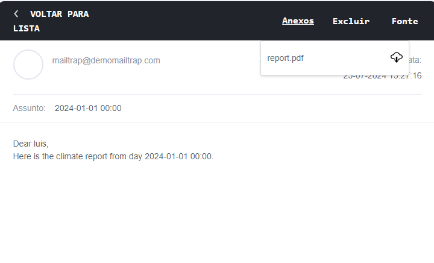

# Climate Reports
## Description

Climate Reports is a Python application designed to process climate data and generate PDF reports. The application provides functionality to create, manage, and send climate reports via email.

## Setup and Installation
### Using Docker Compose

To set up and run the application using Docker Compose:

1. Setup Configuration:
    - Duplicate env-sample.py and rename it to env.py.
    - Add SMTP configurations to env.py.

2. Build and Run Containers:

    ```bash
    docker-compose up --build
    ```
    This command will start the application and expose the TCP server on port 5784.

3. Attach to the Container:

    ```bash
    docker exec -it <container_name> /bin/bash
    ```
    Replace <container_name> with the name of your running container. You can find it using docker ps.

4. Activate Conda Environment:
    Inside the container, activate the Conda environment:
    ```bash
    conda activate your_env_name
    ```

5. Navigate to the Application Directory:
    ```bash
    cd /app
    ```

6. Run Commands:
    
    You can now execute any commands needed within the container.

### Manual Setup

If you prefer to set up the environment manually:

1. Create Conda Environment:
    ```bash
    conda env create -f environment.yml -n <environment_name>
    ```

    Replace <environment_name> with the name you want to your enviroment.

2. Activate Conda Environment:
    ```bash
    conda activate <environment_name>
    ```

3. Setup Configuration:
    - Duplicate env-sample.py and rename it to env.py.
    - Add SMTP configurations to env.py.

4. Navigate to the Application Directory:
    ```bash
    cd climate_reports_generator
    ```


## Usage
### Start TCP Server
To start the TCP server:
```bash
python climate_reports_generator/main.py
```
### Run Tests and Create Sample Data (Optional)
To run tests and populate the database with sample data:

```bash
pytest climate_reports_generator/tests.py
```

### Generate PDF Reports
To generate a PDF report, place your data file in the `climate_reports_generator/raw_data/` directory. Then run the following command:

```bash
python climate_reports_generator/report_generator.py TELEFONE DATA BRUTO [--ENVIA_EMAIL]
```
This command will generate the PDF, save it to `climate_reports_generator/generated_reports/`, and send it to the user's email.

- TELEFONE:
    - Description: Phone number(s) of the users who will receive the report. You can specify one or more numbers, separated by commas.
    - Format: 01234567891 or 01234567891,78945612348

- DATA:
    - Description: The date and time for the report. This is used to timestamp the report.
    - Format: YYYY-MM-DDTHH:MM
- BRUTO:
    - Description: Path to the raw report data file in JSON format. This file should be located in the `climate_reports_generator/raw_data/` directory.
    - Format: climate_reports_generator/raw_data/test_data.txt
- `--ENVIA_EMAIL` (Optional):
    - Description: A flag to indicate if the report should be sent via email. If this flag is included, the generated report will be sent to the users' email addresses.
    - Type: Boolean flag (true if provided, false otherwise)

    <details>
    <summary>Example Command</summary>
    <code>python climate_reports_generator/report_generator.py 01234567891,78945612348 2024-01-01T00:00 climate_reports_generator/raw_data/test_data.txt --ENVIA_EMAIL</code>
    </details>

### Test Email Functionality
To test email functionality, use an SMTP service such as Mailtrap (free plan allows sending emails to registered address). The application will send the report to the user’s email.

### Example Output
The generated report will be attached to an email. Here is a example:
